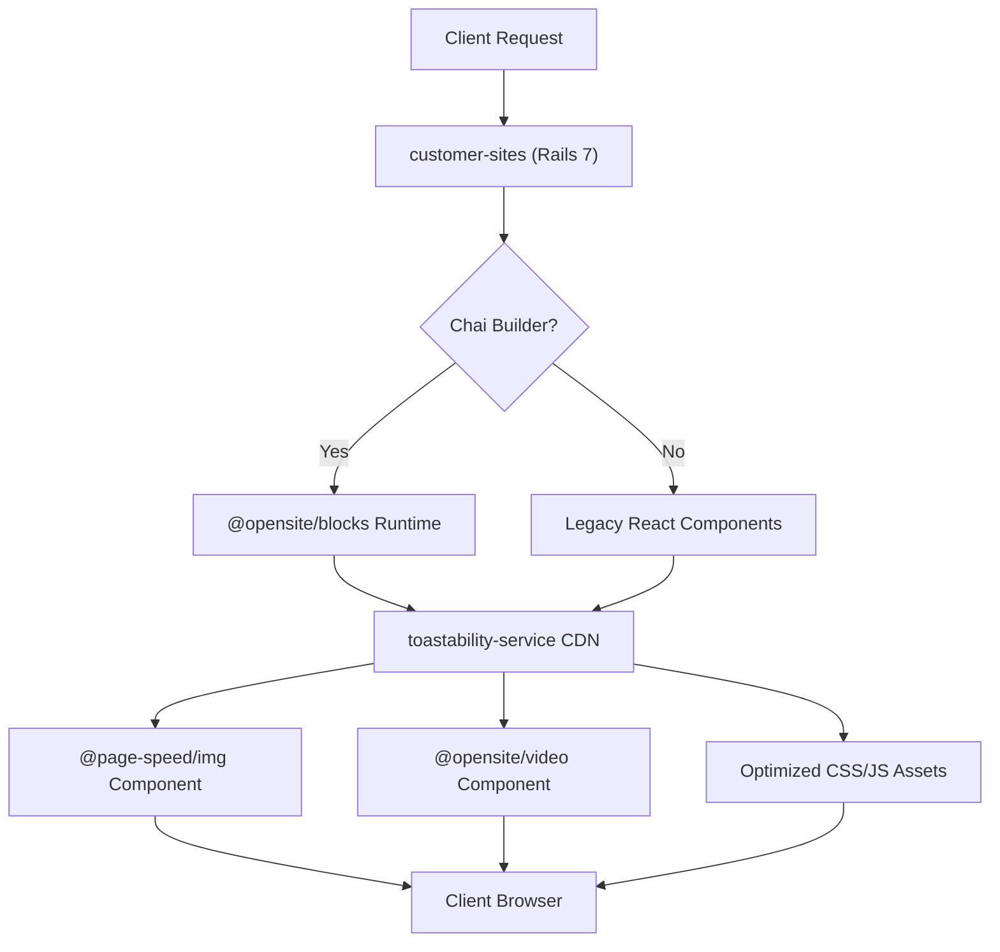

# DashTrack Ecosystem Performance Guidelines

## Overview

This document provides comprehensive guidelines for creating and maintaining modules in the DashTrack platform ecosystem, designed to support 300+ client websites through ultra-high performance architecture. The platform utilizes a modern rendering pipeline from `customer-sites` (Rails) → `@opensite/blocks` (React rendering runtime) → optimized media components (`@page-speed/img`, `@opensite/video`) with robust CDN caching.

## Core Architecture Flow

### Client Website Rendering Pipeline



1. **Entry Point**: `customer-sites` Rails application serves all client websites via dynamic subdomains
2. **Rendering Engine**: `@opensite/blocks` processes design payloads from `toastability-service/assets/components/:id`
3. **Media Optimization**: `@page-speed/img` and `@opensite/video` provide responsive, format-optimized media delivery
4. **Page Building**: `@opensite/ui` powers the semantic UI components for building pages
5. **CDN Layer**: `toastability-service` provides robust asset caching with strong ETags and Cloudflare integration

## Core Architecture Principles

### 1. Performance-First Design

Every module must prioritize Core Web Vitals and ultra-fast loading:

**2024 Core Web Vitals Thresholds:**

- **LCP (Largest Contentful Paint)**: ≤ 2.5s (Good), 2.5-4s (Needs Improvement), >4s (Poor)
- **INP (Interaction to Next Paint)**: ≤ 200ms (Good), 200-500ms (Needs Improvement), >500ms (Poor)
- **CLS (Cumulative Layout Shift)**: ≤ 0.1 (Good), 0.1-0.25 (Needs Improvement), >0.25 (Poor)

### 2. Current Rendering Architecture

**Client Site Flow:**

```typescript
// customer-sites/app/javascript/chai_pages.tsx
// Uses @opensite/blocks for modern Chai-based sites
import { BlocksRenderer, PageBlocksRenderer } from "@opensite/blocks";

// Renders blocks from either:
// 1. Embedded design payload (faster)
// 2. CDN fetch from toastability-service/assets/components/:id (fallback)
```

**Module Structure Pattern:**

```
@opensite/[module-name]/
├── core/                    # Core rendering components
├── api/                     # CDN fetching utilities
├── utils/                   # Design payload manipulation
├── types/                   # TypeScript definitions
└── index.ts                 # Tree-shakable exports
```

### 3. Ultra-Optimized Tree-Shaking

All modules must be optimized for minimal bundle impact using granular exports:

#### Package.json Exports (Following @opensite/blocks Pattern)

```json
{
  "exports": {
    ".": {
      "import": "./dist/index.js",
      "require": "./dist/index.cjs",
      "types": "./dist/index.d.ts"
    },
    "./core": {
      "import": "./dist/core/index.js",
      "require": "./dist/core/index.cjs",
      "types": "./dist/core/index.d.ts"
    },
    "./core/blocks-renderer": {
      "import": "./dist/core/BlocksRenderer.js",
      "require": "./dist/core/BlocksRenderer.cjs",
      "types": "./dist/core/BlocksRenderer.d.ts"
    },
    "./api/fetch-design": {
      "import": "./dist/api/fetchDesignPayload.js",
      "require": "./dist/api/fetchDesignPayload.cjs",
      "types": "./dist/api/fetchDesignPayload.d.ts"
    }
  },
  "sideEffects": false
}
```

#### Optimized Import Patterns

```typescript
// ✅ PREFERRED: Granular imports for minimal bundle size
import { BlocksRenderer } from "@opensite/blocks/core/blocks-renderer";
import { fetchDesignPayloadForPage } from "@opensite/blocks/api/fetch-design";
import { Img } from "@page-speed/img/core";
import { Video } from "@opensite/video/core";

// ✅ GOOD: Module-level imports
import { BlocksRenderer } from "@opensite/blocks/core";
import { Img } from "@page-speed/img";

// ⚠️ AVOID: Full package imports increase bundle size
import * from "@opensite/blocks";
```

### 4. Current CDN & Caching Architecture

**toastability-service CDN Routes with Strong ETag Caching:**

```ruby
# /assets/components/:id - Design payloads
class Assets::ComponentsController
  # Strong ETag: cache_key_with_version for efficient revalidation
  # Browser TTL: 1 month, Edge TTL: 1 hour via CDN-Cache-Control
  # CORS: Access-Control-Allow-Origin: *
end

# /assets/websites/:website_id/tailwind.css - Dynamic CSS
class Assets::Websites::TailwindController  
  # Cache-Control: max-age=0, must-revalidate (immediate ETag revalidation)
end

# /assets/images/:id - Optimized media metadata
class Assets::ImagesController
  # Processing complete: 1 year cache, Processing: 1 hour cache
  # CDN-Cache-Control: max-age=7200 (2 hour edge cache)
end
```

**Performance Requirements:**

- **LCP Optimization**: Preload critical resources, optimize images (WebP), reduce server response time
- **INP Optimization**: Lightweight event handlers, minimal JavaScript execution, lazy loading
- **CLS Prevention**: Defined media dimensions, reserved space for dynamic content

## Current Module Ecosystem

### 1. Core Rendering Modules

#### `@opensite/blocks` - Primary Site Renderer

**Purpose**: Processes Chai design payloads into React components
**Used By**: `customer-sites` Rails app for all modern client websites

```typescript
// Core rendering components
import { BlocksRenderer, PageBlocksRenderer } from "@opensite/blocks";
import { parseDesignPayload } from "@opensite/blocks/utils/design";

// Registry-based block rendering system
// Fetches payloads from: https://cdn.ing/assets/components/:page_id
```

#### `@page-speed/img` - Optimized Image Component

**Purpose**: Responsive images with format optimization (AVIF, WebP, JPEG)
**Used By**: `@opensite/blocks` for media rendering

```typescript
// Usage pattern for optimal performance
 with full srcset variants
  // Automatically transforms image to pixel perfect image in the optimal format & caches then streams from CDN
/>
```

#### `@opensite/video` - Performance Video Component

**Purpose**: Progressive enhancement video with conditional streaming
**Used By**: `@opensite/blocks` for video content

```typescript
// Minimal initial bundle, upgrades to HLS/DASH when needed
<Video mediaId={videoRecord.id} />
```

### 2. Builder & Development Modules

#### `@opensite/builder-sdk` - Visual Page Builder

**Purpose**: Forked ChaiBuilder with DashTrack customizations  
**Used By**: `dt-cms/Source` for visual page building
**Access**: Restricted private npm module

```typescript
// Tree-shakable exports for builder functionality  
import { ChaiBuilderEditor } from "@opensite/builder-sdk";
import { ChaiTheme } from "@opensite/builder-sdk/tailwind";
import { BlockRenderer } from "@opensite/builder-sdk/render";
```

#### Supporting Infrastructure Modules

**`@opensite/icons`**: Self-hosted Iconify server (deployed at `icons.opensite.ai`)
**`@opensite/core`**: Shared rendering runtime utilities
**`@opensite/component-library`**: Reusable UI components
**`@opensite/onboarding`**: Conversational onboarding workflows

### 3. Performance Monitoring & Optimization

#### Core Web Vitals Tracking

```typescript
// Performance monitoring pattern for all modules
export class PerformanceTracker {
  // Track LCP for critical rendering path
  trackLCP(elementSelector: string) {
    const observer = new PerformanceObserver((entryList) => {
      for (const entry of entryList.getEntries()) {
        if (entry.entryType === 'largest-contentful-paint') {
          this.recordMetric('lcp', entry.startTime);
        }
      }
    });
    observer.observe({ entryTypes: ['largest-contentful-paint'] });
  }

  // Track INP for interaction responsiveness
  trackINP(element: HTMLElement) {
    // Measure interaction latency
    const startTime = performance.now();
    element.addEventListener('click', () => {
      const duration = performance.now() - startTime;
      this.recordMetric('inp', duration);
    });
  }

  // Track CLS to prevent layout shifts
  trackCLS() {
    let clsValue = 0;
    new PerformanceObserver((entryList) => {
      for (const entry of entryList.getEntries()) {
        if (!entry.hadRecentInput) {
          clsValue += entry.value;
          this.recordMetric('cls', clsValue);
        }
      }
    }).observe({ entryTypes: ['layout-shift'] });
  }
}
```

## Development Standards

### 1. TypeScript Configuration

```json
{
  "compilerOptions": {
    "target": "ES2022",
    "module": "ESNext",
    "moduleResolution": "bundler",
    "declaration": true,
    "outDir": "./dist",
    "strict": true,
    "skipLibCheck": true,
    "esModuleInterop": true
  },
  "include": ["src/**/*"],
  "exclude": ["node_modules", "dist", "**/*.test.ts"]
}
```

### 2. Build Configuration

```json
{
  "scripts": {
    "build": "tsc && node scripts/post-build.js",
    "build:watch": "tsc -w",
    "test": "vitest",
    "test:ci": "vitest run --coverage",
    "lint": "eslint src --ext .ts,.tsx",
    "bundle-analysis": "node scripts/analyze-bundle.js"
  }
}
```

### 3. Testing Requirements

- **Unit Tests**: 90%+ coverage
- **Integration Tests**: Cross-module compatibility
- **Performance Tests**: Bundle size and runtime performance
- **Tree-shaking Tests**: Validate import patterns

## Advanced Performance Optimization Strategies

### 1. Progressive Enhancement Pattern (@opensite/video example)

```typescript
// Start with basic video, upgrade to streaming when needed
export const Video: React.FC<VideoProps> = ({ mediaId }) => {
  const [streamingEnabled, setStreamingEnabled] = useState(false);
  const capabilities = useBrowserCapabilities();

  useEffect(() => {
    // Only load streaming adapters when beneficial
    if (capabilities.supportsHLS && shouldUpgradeToStreaming(mediaId)) {
      import('./streaming/hls-adapter').then(() => {
        setStreamingEnabled(true);
      });
    }
  }, [mediaId, capabilities]);

  return streamingEnabled ? (
    <StreamingVideo mediaId={mediaId} />
  ) : (
    <BasicVideo mediaId={mediaId} />
  );
};
```

### 2. Smart Caching with ETag Integration

```typescript
// Align with toastability-service caching strategy
export class CdnCacheManager {
  async fetchWithETag<T>(url: string, cacheKey: string): Promise<T> {
    const cached = this.getFromCache(cacheKey);
    const headers: HeadersInit = {};
    
    if (cached?.etag) {
      headers['If-None-Match'] = cached.etag;
    }

    const response = await fetch(url, { headers });
    
    if (response.status === 304) {
      return cached.data; // Use cached version
    }
    
    const etag = response.headers.get('ETag');
    const data = await response.json();
    
    if (etag) {
      this.setInCache(cacheKey, { data, etag });
    }
    
    return data;
  }
}
```

### 3. Registry-Based Rendering (@opensite/blocks pattern)

```typescript
// Efficient block rendering with minimal overhead
export class BlockRenderer {
  private rendererRegistry = new Map<string, ComponentType>();

  // Register block renderers on-demand
  registerRenderer(blockType: string, component: ComponentType) {
    this.rendererRegistry.set(blockType, component);
  }

  // Render blocks recursively with tree-shaking friendly imports
  renderBlock({ block, context }: RenderContext) {
    const Renderer = this.rendererRegistry.get(block._type);
    
    if (!Renderer) {
      // Lazy load renderer only when needed
      return this.loadRendererAndRender(block, context);
    }

    return (
      <Renderer {...block.props}>
        {block._id && context.renderChildren(block._id)}
      </Renderer>
    );
  }

  private async loadRendererAndRender(block: ChaiBlock, context: any) {
    // Dynamic import prevents unused renderers from being bundled
    const { [block._type]: Renderer } = await import(`./renderers/${block._type}`);
    this.registerRenderer(block._type, Renderer);
    return this.renderBlock({ block, context });
  }
}
```

### 4. Bundle Size Monitoring & Analysis

```typescript
// Real-time bundle impact tracking
export const BundleAnalytics = {
  // Track actual module usage for optimization decisions
  trackModuleUsage(moduleName: string, feature: string) {
    const usage = {
      module: moduleName,
      feature,
      timestamp: Date.now(),
      url: window.location.href,
      bundle_size: this.estimateModuleSize(moduleName)
    };
    
    // Send to analytics for usage-based optimization
    this.sendToAnalytics('module_usage', usage);
  },

  // Monitor Core Web Vitals impact
  trackPerformanceImpact(moduleName: string, metrics: CoreWebVitals) {
    const impact = {
      module: moduleName,
      lcp: metrics.lcp,
      inp: metrics.inp, 
      cls: metrics.cls,
      timestamp: Date.now()
    };
    
    this.sendToAnalytics('performance_impact', impact);
  },

  // Detect unused module imports for tree-shaking optimization
  detectUnusedImports() {
    if (process.env.NODE_ENV === 'development') {
      const allModules = performance.getEntriesByType('navigation');
      // Report modules loaded but never executed
    }
  }
};
```

## Memory Management

### 1. Automatic Resource Cleanup

```typescript
// Resource management pattern
export class ResourceManager {
  private resources = new Set<Disposable>();

  register<T extends Disposable>(resource: T): T {
    this.resources.add(resource);
    return resource;
  }

  dispose() {
    for (const resource of this.resources) {
      resource.dispose();
    }
    this.resources.clear();
  }
}
```

### 2. Memory Leak Prevention

```typescript
// Memory leak prevention
export class ComponentManager {
  private observers = new WeakMap();
  private timers = new Set<number>();

  setupObserver(element: Element, callback: Function) {
    const observer = new MutationObserver(callback);
    this.observers.set(element, observer);
    observer.observe(element, { childList: true });
  }

  cleanup() {
    // Timers
    for (const timer of this.timers) {
      clearInterval(timer);
    }
    this.timers.clear();

    // Observers are automatically cleaned up by WeakMap
  }
}
```

## Error Handling & Monitoring

### 1. Error Hierarchy

```typescript
// Standardized error types
export class ModuleError extends Error {
  constructor(
    message: string,
    public code: string,
    public module: string,
    public context?: any
  ) {
    super(message);
    this.name = `${module}Error`;
  }
}

export class ValidationError extends ModuleError {
  constructor(message: string, module: string, invalidValue?: any) {
    super(message, "VALIDATION_ERROR", module, { invalidValue });
  }
}
```

### 2. Performance Monitoring

```typescript
// Performance tracking
export class PerformanceMonitor {
  private metrics = new Map<string, number[]>();

  recordOperation(name: string, duration: number) {
    if (!this.metrics.has(name)) {
      this.metrics.set(name, []);
    }
    this.metrics.get(name)!.push(duration);
  }

  getAverageTime(name: string): number {
    const times = this.metrics.get(name) || [];
    return times.reduce((sum, time) => sum + time, 0) / times.length;
  }

  getStats() {
    const stats: Record<string, any> = {};
    for (const [name, times] of this.metrics) {
      stats[name] = {
        count: times.length,
        average: this.getAverageTime(name),
        min: Math.min(...times),
        max: Math.max(...times),
      };
    }
    return stats;
  }
}
```

## Plugin System Architecture

### 1. Plugin Interface

```typescript
// Standardized plugin interface
export interface OpenSitePlugin {
  name: string;
  version: string;
  description?: string;
  dependencies?: string[];

  // Lifecycle hooks
  onInit?(): Promise<void> | void;
  onDispose?(): Promise<void> | void;

  // Extension points
  extendModule?(module: any): void;
  registerComponents?(registry: ComponentRegistry): void;

  // Configuration
  configDefaults?: Record<string, any>;
  validateConfig?(config: Record<string, any>): boolean;
}
```

### 2. Plugin Manager

```typescript
// Plugin management system
export class PluginManager {
  private plugins = new Map<string, OpenSitePlugin>();
  private registry = new ComponentRegistry();

  async loadPlugin(plugin: OpenSitePlugin) {
    // Validate dependencies
    for (const dep of plugin.dependencies || []) {
      if (!this.plugins.has(dep)) {
        throw new Error(`Plugin ${plugin.name} depends on ${dep}`);
      }
    }

    // Initialize plugin
    if (plugin.onInit) {
      await plugin.onInit();
    }

    // Register components
    if (plugin.registerComponents) {
      plugin.registerComponents(this.registry);
    }

    this.plugins.set(plugin.name, plugin);
  }
}
```

## Testing & Quality Assurance

### 1. Performance Testing Requirements

```typescript
// Core Web Vitals testing suite
export class PerformanceTestSuite {
  // Test LCP under 2.5s threshold
  async testLCP(pageUrl: string): Promise<boolean> {
    const page = await this.browser.newPage();
    await page.goto(pageUrl);
    
    const lcp = await page.evaluate(() => {
      return new Promise((resolve) => {
        new PerformanceObserver((entryList) => {
          const entries = entryList.getEntries();
          if (entries.length > 0) {
            resolve(entries[entries.length - 1].startTime);
          }
        }).observe({ entryTypes: ['largest-contentful-paint'] });
      });
    });
    
    return lcp <= 2500; // Must be under 2.5s
  }

  // Test bundle size limits
  async testBundleSize(moduleName: string): Promise<boolean> {
    const stats = await this.getBundleStats(moduleName);
    const sizeLimit = this.getSizeLimitFor(moduleName);
    
    return stats.gzippedSize <= sizeLimit;
  }

  // Test tree-shaking effectiveness
  async testTreeShaking(importPath: string): Promise<boolean> {
    const bundle = await this.createTestBundle([
      `import { SpecificFunction } from "${importPath}";`
    ]);
    
    // Ensure only the specific function is included
    return !bundle.includes('UnusedFunction');
  }
}
```

### 2. End-to-End Performance Integration

```typescript
// Test complete rendering pipeline
describe("DashTrack Rendering Pipeline", () => {
  it("should render client sites under performance thresholds", async () => {
    // Test customer-sites → @opensite/blocks → media components flow
    const testSite = await TestSiteBuilder
      .withChaiBlocks([
        { _type: 'image', mediaReference: 'test-image' },
        { _type: 'video', mediaReference: 'test-video' }
      ])
      .build();

    const metrics = await PerformanceTester.measureSite(testSite.url);
    
    expect(metrics.lcp).toBeLessThan(2500);
    expect(metrics.inp).toBeLessThan(200);
    expect(metrics.cls).toBeLessThan(0.1);
  });

  it("should cache design payloads effectively", async () => {
    const componentUrl = `https://cdn.ing/assets/components/${testPageId}`;
    
    // First request should return 200 with ETag
    const firstResponse = await fetch(componentUrl);
    expect(firstResponse.status).toBe(200);
    
    const etag = firstResponse.headers.get('ETag');
    expect(etag).toBeTruthy();
    
    // Second request with ETag should return 304
    const secondResponse = await fetch(componentUrl, {
      headers: { 'If-None-Match': etag }
    });
    expect(secondResponse.status).toBe(304);
  });
});
```

## Deployment & Distribution

### 1. Build Pipeline

```yaml
# GitHub Actions example
name: Build and Test
on: [push, pull_request]

jobs:
  test:
    runs-on: ubuntu-latest
    steps:
      - uses: actions/checkout@v3
      - uses: actions/setup-node@v3
        with:
          node-version: "18"
      - run: npm ci
      - run: npm run test:ci
      - run: npm run build
      - run: npm run bundle-analysis
```

### 2. Versioning Strategy

```json
{
  "version": "1.0.0",
  "publishConfig": {
    "access": "public",
    "registry": "https://registry.npmjs.org/"
  }
}
```

## Quality Assurance

### 1. Code Quality Metrics

- **Bundle Size**: Track and limit bundle sizes
- **Performance**: Monitor runtime performance
- **Memory Usage**: Prevent memory leaks
- **Tree-shaking**: Validate import optimization

### 2. Continuous Monitoring

```typescript
// Quality monitoring
export class QualityMonitor {
  static trackBundleSize(moduleName: string, size: number) {
    if (size > this.getBundleLimit(moduleName)) {
      console.warn(`Bundle size exceeded for ${moduleName}: ${size}KB`);
    }
  }

  static trackPerformance(operation: string, duration: number) {
    if (duration > this.getPerformanceLimit(operation)) {
      console.warn(
        `Performance threshold exceeded for ${operation}: ${duration}ms`
      );
    }
  }
}
```

## Migration Strategy

### 1. Legacy Module Migration

```typescript
// Migration helper
export class MigrationHelper {
  static async migrateFrom(legacyModule: any, newModule: any) {
    // Extract configuration
    const config = this.extractConfig(legacyModule);

    // Initialize new module
    await newModule.init(config);

    // Migrate data
    const data = await this.extractData(legacyModule);
    await newModule.importData(data);

    // Verify migration
    return this.verifyMigration(legacyModule, newModule);
  }
}
```

### 2. Backward Compatibility

```typescript
// Compatibility layer
export class CompatibilityLayer {
  static wrapLegacyApi(newModule: any) {
    return {
      // Legacy method names
      oldMethod: newModule.newMethod.bind(newModule),
      anotherOldMethod: newModule.anotherNewMethod.bind(newModule),

      // Deprecation warnings
      deprecatedMethod() {
        console.warn("deprecatedMethod is deprecated, use newMethod instead");
        return newModule.newMethod.apply(newModule, arguments);
      },
    };
  }
}
```

## Performance Success Metrics

### Core Web Vitals Compliance (2024 Standards)

**Target Thresholds for 75th Percentile:**

- **LCP**: ≤ 2.5 seconds (loading performance)
- **INP**: ≤ 200 milliseconds (interactivity)
- **CLS**: ≤ 0.1 (visual stability)

### Bundle Size Limits by Module Type

- **Core Rendering** (`@opensite/blocks`): ≤ 50KB gzipped
- **Media Components** (`@page-speed/img`, `@opensite/video`): ≤ 15KB gzipped each
- **Builder SDK** (`@opensite/builder-sdk`): ≤ 200KB gzipped (editor-only)
- **Utility Modules**: ≤ 10KB gzipped per module

### CDN Cache Effectiveness

- **Design Payloads**: 95%+ cache hit rate with strong ETag revalidation
- **Media Assets**: 1 year browser cache, 2 hour edge cache
- **Dynamic CSS**: Immediate revalidation with ETag for style changes

## Implementation Checklist

Every new module must:

✅ **Performance Requirements**

- [ ] Tree-shakable exports with granular imports
- [ ] Core Web Vitals compliance testing
- [ ] Bundle size under category limits
- [ ] Progressive enhancement where applicable

✅ **Architecture Compliance**

- [ ] Integration with current rendering pipeline
- [ ] Strong ETag caching strategy
- [ ] TypeScript strict mode compatibility
- [ ] React 18+ SSR compatibility

✅ **Quality Standards**

- [ ] Performance regression testing
- [ ] Cross-module integration tests
- [ ] Bundle analysis in CI/CD
- [ ] Real User Monitoring (RUM) integration

Following these guidelines ensures the DashTrack platform maintains ultra-high performance while serving 300+ client websites with optimal user experience and Core Web Vitals compliance.
